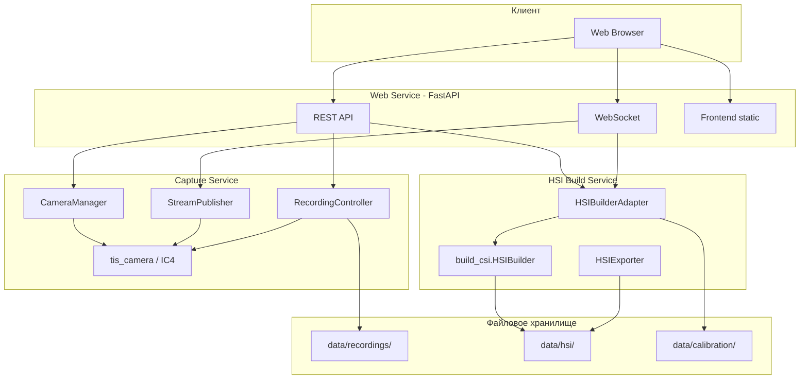
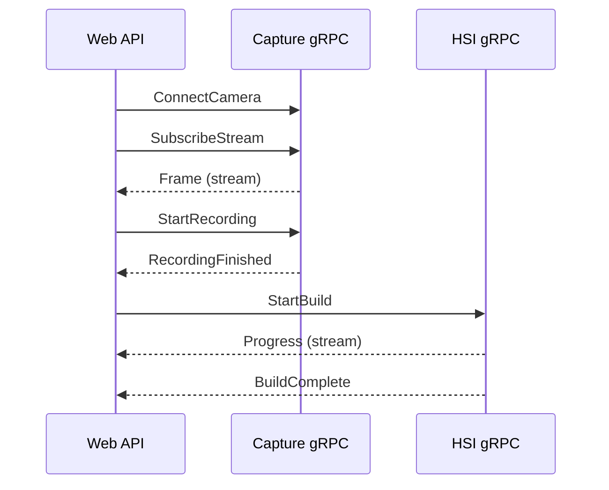
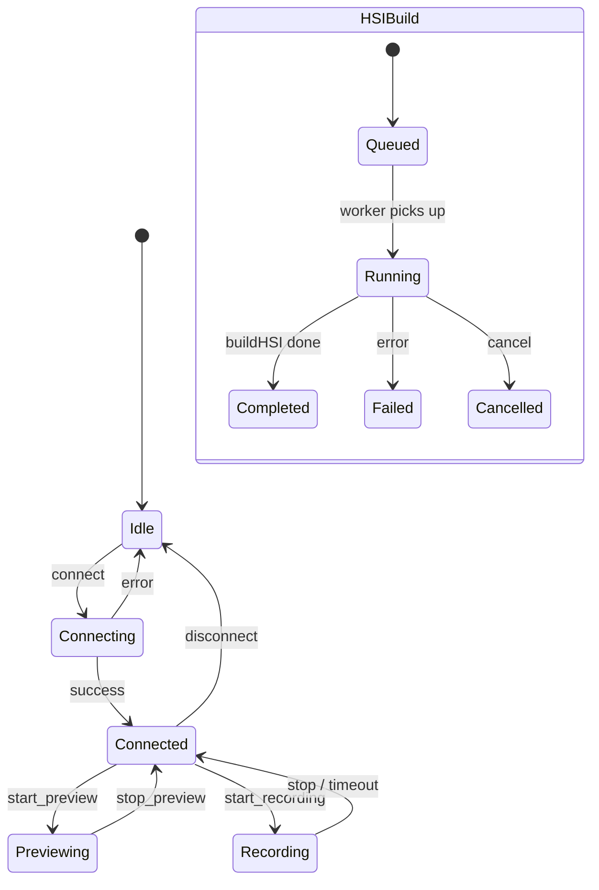

# Архитектура системы

## 1. Назначение

Система предоставляет единый веб-интерфейс для:

1. подключения и настройки камеры гиперспектральной установки;
2. просмотра видеопотока в реальном времени;
3. записи исходного материала (push-broom / line-scan);
4. сборки гиперспектрального куба (HSI/GSI) из записи;
5. просмотра, анализа и экспорта результатов.

Новая разработка **не дублирует** алгоритмы обработки — они делегируются существующему ядру `build_csi`.

---

## 2. Высокоуровневая схема



---

## 3. Сервисы

### 3.1. Сервис управления съёмкой (Capture Service)

**Ответственность:** жизненный цикл камеры, параметры, поток, запись.

| Функция | Описание |
|---|---|
| `connect` | Открытие устройства, инициализация IC4 |
| `disconnect` | Закрытие устройства, освобождение ресурсов |
| `get_status` | Статус подключения, модель, serial, USB speed |
| `list_modes` | Доступные режимы WIDTH×HEIGHT@FPS |
| `get_properties` / `set_property` | Экспозиция, gain, focus и др. GenICam-свойства |
| `start_preview` | Запуск непрерывного потока |
| `stop_preview` | Остановка потока |
| `start_recording` | Start/Stop или по таймеру |
| `stop_recording` | Ручная остановка |
| `get_recording_status` | Состояние, elapsed, путь к файлу |

**Реализация камеры:** модуль `tis_camera/` (IC Imaging Control 4, GenTL USB3 Vision).

**Выход записи:** TIS RAW (`.raw` + `.raw.json`) — промежуточный формат; при необходимости конвертация в видео/последовательность кадров для `HSIBuilder`.

**Платформы:** Windows, Linux (официальная поддержка IC4). macOS — только UI/API без локальной камеры, либо удалённый capture-agent.

---

### 3.2. Сервис сборки HSI (HSI Build Service)

**Ответственность:** асинхронная сборка гиперспектрального куба.

| Функция | Описание |
|---|---|
| `list_build_presets` | Доступные режимы сборки из библиотеки |
| `validate_params` | Проверка ROI, длин волн, калибровки |
| `start_build` | Запуск `HSIBuilder.buildHSI(...)` в фоне |
| `get_progress` | Процент, этап, ETA |
| `cancel_build` | Отмена задачи |
| `get_result` | Метаданные готового HSI |
| `export` | GeoTIFF, TIFF, MAT, NPY, DAT, HSI + sidecars |

**Ядро:** каталог `build_csi`, класс `HSIBuilder` (внешняя зависимость, Dev-ветка Git).

**Адаптер:** `HSIBuilderAdapter` — тонкая обёртка, пробрасывающая параметры и колбэк прогресса без изменения алгоритмов.

---

### 3.3. Веб-сервис (Web API Gateway)

**Ответственность:** единая точка входа для frontend и внешних клиентов.

| Протокол | Назначение |
|---|---|
| REST (HTTP/JSON) | Команды, конфигурация, статусы, скачивание файлов |
| WebSocket | Видеопоток (JPEG-кадры), прогресс сборки, события записи |
| Static files | Собранный frontend (React) |

**Технологии:** FastAPI, Uvicorn, asyncio, фоновые задачи (`BackgroundTasks` / отдельный worker).

**Режим развёртывания:**

| Режим | Когда использовать |
|---|---|
| **Modular Monolith** | MVP: все сервисы в одном процессе FastAPI, разделение по пакетам |
| **Microservices** | Продакшен: capture и HSI в отдельных процессах, общение через gRPC |

По умолчанию в документации заложен **modular monolith** с возможностью выноса сервисов без смены API.

---

## 4. Коммуникация между компонентами

### 4.1. Внутренняя (MVP — in-process)

```
web_api/routers  →  services/capture  →  tis_camera/
                 →  services/hsi       →  build_csi/
```

Интерфейсы определены как Python Protocol / ABC в `shared/contracts/`.

### 4.2. Внутренняя (масштабируемый вариант)



Proto-файлы: `shared/proto/capture.proto`, `shared/proto/hsi.proto`.

### 4.3. Видеопоток до браузера

| Вариант | Плюсы | Минусы |
|---|---|---|
| **WebSocket + JPEG** | Простота, работает везде | Больше трафика, latency |
| **WebSocket + raw + WebGL** | Меньше CPU на сервере | Сложнее frontend |
| **WebRTC** | Низкая задержка | Сложная настройка |
| **UDP (внутренний)** | Минимальная задержка | Не доходит до браузера напрямую |

**Рекомендация для v1:** WebSocket, сервер публикует JPEG-кадры с настраиваемым FPS/quality. gRPC/UDP — между capture-agent и gateway при распределённой установке.

---

## 5. Асинхронность и задачи



| Операция | Механизм |
|---|---|
| Захват кадров | Отдельный thread (IC4 blocking) + asyncio queue |
| Запись | Thread + периодический flush на диск |
| Сборка HSI | `ProcessPoolExecutor` или subprocess (GIL / native lib) |
| Прогресс | Callback из `HSIBuilder` → `asyncio.Queue` → WebSocket |

---

## 6. Хранение данных

```
data/
├── recordings/          # RAW / видео исходники
├── hsi/                 # Собранные кубы
├── exports/             # Экспортированные файлы
├── calibration/         # ROI, wavelengths, coefficients
└── jobs/                # JSON-статусы фоновых задач
```

Пути конфигурируются через `config/settings.yaml` или переменные окружения.

---

## 7. Калибровка

Параметры калибровки гиперспектрометра передаются в `buildHSI` без модификации:

| Параметр | Источник |
|---|---|
| ROI | `data/calibration/roi.json` или UI |
| Wavelengths | `data/calibration/wavelengths.json` |
| Coefficients | Файлы от разработчиков библиотеки |
| Sensor geometry | Метаданные камеры + калибровка |

Сервис HSI валидирует наличие файлов до запуска сборки.

---

## 8. Безопасность (v1 — базовый уровень)

- Локальная сеть, без аутентификации (лабораторная установка).
- CORS — только доверенные origin.
- Пути файлов — sandbox внутри `data/`, защита от path traversal.
- v2: JWT / API keys при удалённом доступе.

---

## 9. Расширяемость (заложено архитектурно, не в v1)

| Модуль | Интерфейс-заглушка |
|---|---|
| Подвижка (stage) | `shared/contracts/stage.py` → `StageController` |
| Синхронизация скорости | `CaptureService.set_line_rate()` |
| Моторизованная платформа | `StageController.move_to()` |

См. [ROADMAP.md](./ROADMAP.md).

---

## 10. Зависимости

| Компонент | Зависимость |
|---|---|
| Камера | IC4 SDK + GenTL USB3 Vision driver |
| HSI | `build_csi` (Dev branch) |
| Backend | FastAPI, uvicorn, pydantic, numpy |
| Frontend | React + TypeScript + Vite |
| Опционально | gRPC, protobuf, docker-compose |

---

## 11. Связь с текущим кодом

Уже реализовано в `tis_camera/`:

- `capture_to_raw()` — основа для `RecordingController`
- `probe_device()`, `enumerate_live_modes()` — для API `/camera/modes`
- `apply_capture_settings()` — для live-настройки экспозиции

Требуется доработка:

- непрерывный preview (`QueueSink` вместо `SnapSink`)
- Start/Stop запись без фиксированной длительности
- live `set_property` для gain, focus
- HTTP/WebSocket обёртка
