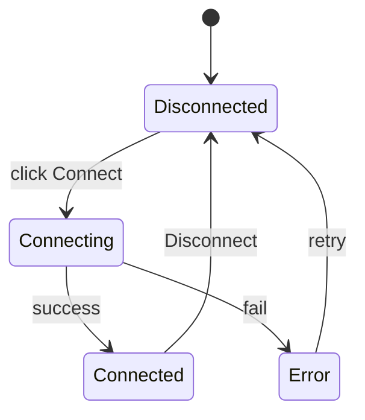

# Frontend: вкладки и UX

**Стек:** React 18 + TypeScript + Vite + TanStack Query + Zustand (или Redux Toolkit).

**UI-kit:** MUI или Ant Design — на усмотрение исполнителя при реализации.

---

## Навигация

```
┌─────────────────────────────────────────────────────────┐
│  HSI System                                    [status] │
├──────────┬──────────┬──────────┬──────────┬─────────────┤
│ Подключ. │  Поток   │  Съёмка  │ Сборка   │  Просмотр   │
└──────────┴──────────┴──────────┴──────────┴─────────────┘
```

Глобальный индикатор: камера подключена / идёт запись / идёт сборка.

---

## Вкладка 1. Подключение

### Элементы

| Элемент | Поведение |
|---|---|
| Статус-бейдж | `Подключена` / `Не подключена` / `Ошибка` |
| Инфо-панель | Модель, serial, vendor, USB speed |
| Кнопка «Подключить» | `POST /camera/connect` |
| Кнопка «Отключить» | `POST /camera/disconnect` |
| Список устройств | если несколько камер (future) |

### Состояния



### API

- `GET /camera/status` — polling каждые 2 с на этой вкладке
- `POST /camera/connect`, `POST /camera/disconnect`

---

## Вкладка 2. Просмотр видеопотока

### Элементы

| Элемент | API |
|---|---|
| `<video>` / `<canvas>` | WebSocket `/ws/stream` |
| Слайдер Exposure | `PATCH /camera/properties` |
| Слайдер Gain | то же |
| Focus (если есть) | то же |
| Dropdown режима | `GET /camera/modes` + apply on change |
| Start / Stop preview | `POST /camera/preview/start|stop` |

### Поведение

- Изменение exposure/gain — debounce 100–300 ms, затем PATCH
- Preview не останавливается при смене параметров (если IC4 поддерживает)
- FPS отображения ограничен (15 fps default для WebSocket)

### WebSocket клиент

```typescript
// hooks/useStream.ts
const ws = new WebSocket(`${WS_URL}/ws/stream`);
ws.onmessage = (ev) => {
  if (ev.data instanceof Blob) displayFrame(ev.data);
  else handleMeta(JSON.parse(ev.data));
};
```

---

## Вкладка 3. Съёмка

### Элементы

| Элемент | Описание |
|---|---|
| Выбор режима | dropdown из `/camera/modes` |
| Exposure | число, µs |
| Pixel format | Mono8 / Mono16 |
| Max duration | checkbox «Без лимита» + поле секунд |
| **Start** | начало записи |
| **Stop** | ручная остановка (активна во время записи) |
| Progress | elapsed time, frame count |
| Результат | путь, duration, кнопка «Открыть» |

### Унифицированный режим (ТЗ)

1. Пользователь задаёт `max_duration` (опционально)
2. Нажимает **Start** → `POST /recording/start`
3. Запись завершается:
   - по **Stop** → `POST /recording/{id}/stop`
   - по таймеру → автоматически
4. Показ результата + ссылка на файл

### Polling / WS

- `GET /recording/{id}` каждую секунду во время записи
- или WebSocket event `recording_progress`

---

## Вкладка 4. Сборка HSI

### Элементы

| Секция | Поля |
|---|---|
| Источник | file picker из `/files/recordings` |
| Build mode | dropdown из `/hsi/presets` |
| Data source | raw / video / ... (из библиотеки) |
| Reconstruction | параметры из библиотеки |
| ROI | x, y, width, height |
| Wavelengths | профиль калибровки или manual |
| Calibration | dropdown профилей `/hsi/calibration` |
| **Build** | `POST /hsi/build` |
| Progress bar | WebSocket `/ws/jobs/{id}` |
| Результат | путь к HSI, кнопка «Открыть в просмотре» |

### Progress UI

```
[████████░░░░░░░░] 42%  reconstruction — line 850/2048
```

---

## Вкладка 5. Просмотр HSI

### 5.1. Поканальный просмотр

| Элемент | API |
|---|---|
| Slider канала / λ | `GET /hsi/{id}/band/{index}` |
| Поле wavelength (nm) | map λ ↔ band index |
| Canvas изображения | PNG с сервера |

### 5.2. Цветосинтез

Использовать реализацию библиотеки:

| Режим | Описание |
|---|---|
| `complex` | через `ComplexData` |
| `simplified` | упрощённый RGB |

UI: выбор режима + R/G/B bands или presets (natural color).

`POST /hsi/{id}/rgb`

### 5.3. Навигация

| Жест | Действие |
|---|---|
| Scroll | Zoom |
| Drag | Pan |
| Click | Показать спектр в точке → `GET /hsi/{id}/spectrum?x=&y=` |
| Spectrum chart | Plotly / recharts под canvas |

### 5.4. Экспорт

Modal: выбор формата (GeoTIFF, TIFF, MAT, NPY, DAT, HSI) + sidecars.

`POST /hsi/{id}/export` → ссылка на скачивание.

---

## Общие компоненты

```
components/
├── CameraStatusBadge.tsx
├── PropertySlider.tsx
├── ModeSelector.tsx
├── RecordingControls.tsx
├── BuildParamsForm.tsx
├── ProgressBar.tsx
├── HsiCanvas.tsx          # zoom/pan
├── SpectrumChart.tsx
├── FilePicker.tsx
└── ExportDialog.tsx
```

## Маршруты (React Router)

| Path | Page |
|---|---|
| `/` | redirect → `/connection` |
| `/connection` | ConnectionPage |
| `/stream` | StreamPage |
| `/capture` | CapturePage |
| `/build` | BuildPage |
| `/viewer/:hsiId?` | ViewerPage |

## Обработка ошибок

- Toast при API 4xx/5xx
- Блокировка вкладок: Stream/Capture недоступны без подключения
- Build недоступен без `build_csi`
